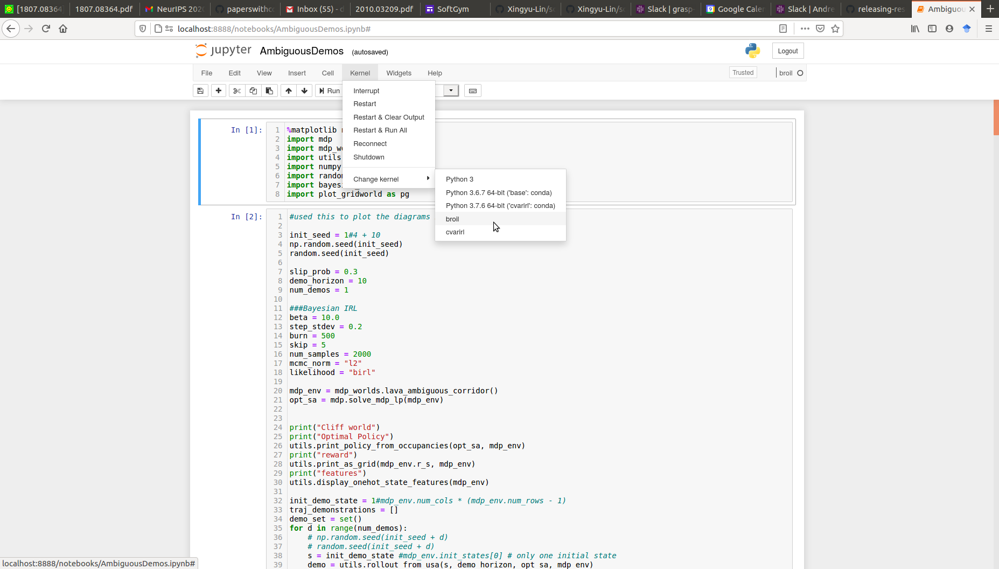

# Bayesian Robust Optmization for Imitatation Learning 

Daniel Brown, Scott Niekum, Marek Petrik

### Read the paper: [arXiv Link](https://arxiv.org/abs/2007.12315).

## Source Code

This repository contains code to reproduce the experiments.

If you find this repository is useful in your research, please cite our paper:
```
@InProceedings{brown2020broil,
  title = {Bayesian Robust Optimization for Imitation Learning},
  author = {Brown, Daniel S. and Niekum, Scott and Petrik, Marek},
  booktitle={Advances in neural information processing systems (NeurIPS)},
  year={2020}
}

```


### First install all dependencies via conda
```
conda env create --file environment.yml
conda activate broil
python -m ipykernel install --user --name=broil
```

Before running any of the commands below, make sure to first activate the conda environment
```
conda activate broil
```

## Machine Replacement Experiment:

### Generate plot of efficient frontier
```
python machine_replacement.py
```
### generate plot of action probs
```
python machine_replacement_action_probs.py
```

### generate and plot histogram of return dists for different values of lambda
```
python machine_replacement_gen_return_dists.py 
python machine_replacement_plot_return_dists.py
```

## Ambiguous Demo Experiment:
To reproduce the ambiguous demonstration experiment run the following ipython notebook:

```
jupyter notebook AmbiguousDemos.ipynb
```

Make sure to change the kernel of the notebook to use the broil conda env by selecting from the dropdown menu: Kernel -> Change kernel -> broil.



## Computational Stress Tests (see [Appendix](https://arxiv.org/abs/2007.12315) for details):
To reproduce the experiments and plots for the computational efficiency stress tests run:

```
python machine_replacement_experiment_stress_test_numrewards.py
python machine_replacement_experiment_stress_test_numstates.py
python grid_world_stress_test_numstates.py
```

Note that these will take a while to run. When they are complete you can generate plots using the following Jupyter notebook:

```
jupyter notebook StressTestPlots.ipynb
```
